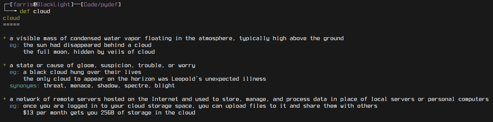

# pydef
A simple CLI python script that queries the [Oxford Dictionary API](https://developer.oxforddictionaries.com/) for the definition of a word.

Note that you'll have to sign up for an API key to be able to use it.

**Usage:**

**Dependencies:**
* `python-requests`

  note: It's a dependency of `pip`, so you probably have it installed already.

**TODO:**
* Make an install script.
* Add word pronounciation.
* Add support for different APIs, like Merriam Webster's API for example.
* Add support for rhymes using Datamuse's API.
